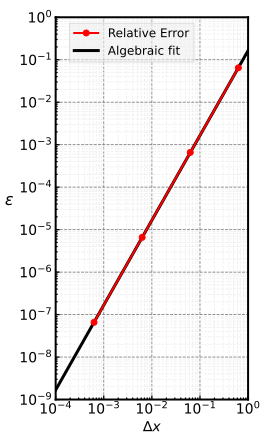

::::::::::::::::::::::::::::::::::::::: objectives

- Explain what a library is and what libraries are used for.
- Import a Python library and use the functions it contains.
- Read tabular data from a file into a program.
- Select individual values and subsections from data.
- Perform operations on arrays of data.

::::::::::::::::::::::::::::::::::::::::::::::::::

:::::::::::::::::::::::::::::::::::::::: questions

- How can I process tabular data files in Python?

::::::::::::::::::::::::::::::::::::::::::::::::::

$\newcommand{\coloneq}{\mathrel{≔}}$
$\def\doubleunderline#1{\underline{\underline{#1}}}$
$\def\tripleunderline#1{\underline{\doubleunderline{#1}}}$
$\def\tprod{{\small \otimes}}$
$\def\tensor#1{{\bf #1}}$
$\def\mat#1{{\bf #1}}$
$\renewcommand{\vec}[1]{{\bf #1}}$
$\def\e{\vec{e}}$

Words are useful, but what's more useful are the sentences and stories
we build with them.  Similarly, while a lot of powerful, general tools
are built into Python, specialized tools built up from these basic units
live in [libraries](../learners/reference.md#library)
that can be called upon when needed.

## The `ndarray`

The base work-horse of the NumPy framework is the `ndarray` object. This
object provides a performant container for tensor algebra. Its
performance, capabilities, base coverage, and syntactical flavor are all
based on the default array type from MATLAB, but arguably provides
greater flexibility for the programmer, especially for third-order or
larger tensors.  

For those familiar with MATLAB, many syntactical features and operations
will seem familiar, but there are subtle differences that may be awkward
at first. For a full reference, see the official docs, [NumPy for MATLAB
users](https://numpy.org/doc/2.1/user/numpy-for-matlab-users.html), 
which provides a Rosetta-Stone-like guide for MATLAB users.

The very first thing to do in Python to work with NumPy is to import the
external library:

```python
import numpy as np
```

This line of code imports the external library into the workspace,
renaming it by common convention to `np`. The `as np` is a shorthand
that would have been equivalent to a second line of code assigning the
name `np=numpy`. For the rest of this lesson, ***we will assume that
NumPy has been imported into the workspace as `np`***. This only has to
be done once per Python invocation. Typically, it will be done at the
top of a Python script (in the header), or in the very first cell of a
Jupyter notebook.

To actually use the library --- i.e., access the classes and methods
within it --- we have to write `np.` and then the target code.

```python
a = np.arange(5)
print(f'{a}\n `a` is of type: {type(a)}\n and `a[0]` type: {type(a[0])}')
```

```output
[0 1 2 3 4]
 `a` is of type: <class 'numpy.ndarray'>
 and `a[0]` type: <class 'numpy.int64'>
```

The code above prints the result of using the `numpy.arange` method,
which is similar to the built-in `range` method, but in this instance
instead generates a one-dimensional `ndarray` object with the first five
non-negative integers (recall, Python is zero-indexed). Also, the
elements of the generated `ndarray`, `a`, are not "vanilla" Python `int`
objects. Instead they are 64-bit integer objects provided by the NumPy
library. This is an implicit hint that we are using Python as a medium
for all future computations: Python is slow so we use it as a convienent
***interface*** with fast NumPy to set up the data structures and
communicate logical instructions for data transformations.

Note that `numpy.arange` is an ***overloaded*** function, meaning that
we can pass a floating-point argument to generate the appropriate NumPy
`ndarray` of `numpy.float64` values very easily.

```python
x = np.arange(5.)
print(f'{x}\n `x` is of type: {type(x)}\n and `x[0]` type: {type(x[0])}')
```
```output
[0. 1. 2. 3. 4.]
 `x` is of type: <class 'numpy.ndarray'>
 and `x[0]` type: <class 'numpy.float64'>
```

This is a valid use of the `numpy.arange` method, but typically we will
want to only generate ranges of `numpy.int64` with the method. The rest
of the materials will only use the `arange` method for generating
integer `ndarray`s.

Unlike the built-in list, the NumPy `ndarray` automatically
***broadcasts*** scalar arithmetic to the elements of the `ndarray`:

```python
a = np.arange(5)
print(f'1+a: {1+a}')
print(f'2*a: {2*a}')
```

```output
1+a: [1 2 3 4 5]
2*a: [0 2 4 6 8]
```

For MATLAB users, `np.arange(<start>,<excluded end>,<stride>)` provides
functionality like the colon operator,
`<start>:<stride>:<included end>`. Thus, we may generate an `ndarray` of
odd numbers without list comprehension, improving performance as a perk,

```python
# benchmark generating the first ten-million odds with vanilla Python
# NOTE: `%timeit` is a "Jupyter Magic," a Jupyter macro, not Python!
%timeit odd_list = [2*k+1 for k in range(10**7)]
%timeit odd_list2 = [k for k in range(1,2*10**7,2)]
%timeit odd_list3 = list(range(1,2*10**7,2))
```

```output
393 ms ± 884 µs per loop (mean ± std. dev. of 7 runs, 1 loop each)
198 ms ± 544 µs per loop (mean ± std. dev. of 7 runs, 10 loops each)
148 ms ± 207 µs per loop (mean ± std. dev. of 7 runs, 10 loops each)
```

```python
# benchmark generating the first ten-million odds with NumPy
%timeit odd_array = 2*np.arange(10**7)+1
# Even less Python and more NumPy:
%timeit odd_array2 = np.arange(1,2*10**7,2)
```

```output
13 ms ± 550 µs per loop (mean ± std. dev. of 7 runs, 100 loops each)
8 ms ± 90 µs per loop (mean ± std. dev. of 7 runs, 100 loops each)
```

Vanilla Python is, at best and worst, nearly 20--50 times slower than
NumPy!  Why is this? It may help to spell out the operations involved. 

#### Vanilla Python 

In this approach, Python is asked to do ten-million product and sum
operations (twenty-million actions), and store the results in a generic,
unoptimized `list` object. The second attempt redundantly converts the
generated iterates of `range(1,2*10**7,2)` to a list, improving
performance by a factor of two. The final attempt removes the redundant
list comprehension. 

#### First NumPy approach

In this solution, `odd_array = 2*np.arange(10**7)+1`, NumPy is asked to
generate a list of the first ten-million non-negative integers, which is
done in a performant C library with the updated memory accessible from
Python's workspace. Then NumPy is told --- through broadcasting --- to
multiply every element by two and add one. It's still twenty-million
actions, but the difference is that Python is only involved up to three
times; the rest is done in an expertly written backend library which is
nearly 30 times faster than the comparable approach in vanilla Python.

#### Second NumPy approach

The last solution, `odd_array2 = np.arange(1,2*10**7,2)` was the
fastest. This is because Python did almost nothing, resulting in a
nearly 20-times speedup and the creation of a significantly more
wieldable `ndarray`.

#### Implicit lesson

To write the best Python programs, adopt the best practices with the
correct external libraries, minimizing the amount of compute that Python
will be responsible for. Python is best when it is used at the highest
level to transform data.

## Naive matrix multiplication

This next example would have been counter productive to introduce prior
to NumPy, as it is an exhausting exercise to even generate
two-dimensional lists in vanilla Python. However, it's much simpler
with NumPy. For instance, to generate a four-by-four of uniformly random
numbers in $(0,1)$:

```python
A = np.random.rand(4,4)
print(A)
```

```output
[[0.95781959 0.9915284  0.58248825 0.41600528]
 [0.77493045 0.67522185 0.00530085 0.2539285 ]
 [0.53248467 0.75761823 0.69219508 0.58811258]
 [0.59892653 0.77743011 0.95975933 0.71425297]]
```

Or we would have to use the standard `random` library, which encourages
bad habits (technique with Python lists and `random` that should not be
practiced, although nested list comprehension has its place in the
toolbox):

```python
import random
A = [ [random.random() for column in range(4)] for row in range(4) ]
for row in A: print(row)
```

```output
[0.6818582562400426, 0.6868889674612016, 0.34483486515037653, 0.9638090861458387]
[0.24086075915520622, 0.07221778821332858, 0.43624157264612706, 0.7935877715986276]
[0.6585256801337919, 0.2631377880223672, 0.9586513851146543, 0.9070537970347129]
[0.1566693962998439, 0.8860807403362514, 0.039423876906426014, 0.44815646838680734]
```

We will write a few ***functions*** to do matrix multiplication with
vanilla Python.

```python
def vanilla_dot_product(u,v):
    running_sum = 0
    for i in range(len(u)):
        running_sum += u[i]*v[i]
    return running_sum
def vanilla_matrix_vector_product(A,x):
    y = [ vanilla_dot_product(a,x) for a in A ]
    return y
def vanilla_matrix_tranpose(A):
    # `*A` passes the first-elements of `A` --- the rows --- to zip as
    # arguments, as if we wrote every row of `A` explicitly.
    # `zip` is a built-in function that iteratively combines the first
    # elements of its arguments, allowing us to iterate over the cols of
    # `A`.
    # `map` is a built-in function that shortcuts a for loop: we are
    # mapping every column of `A` to the `list` class, converting the
    # immutable tuples to lists.
    # The final `list` ensures that `A_Transposed` is a two-dimensional
    # container of "column vectors."
    A_Tranposed = list(map(list,zip(*A)))
    return A_Tranposed
def vanilla_matrix_matrix_product(A,B):
    # `*B` passes the first-elements of `B` --- the rows --- to zip as
    # arguments, as if we wrote every row of `B` explicitly.
    # `zip` is a built-in function that iteratively combines the first
    # elements of its arguments, allowing us to iterate over the cols of
    # `B`.
    CT = [ vanilla_matrix_vector_product(A,b_col) for b_col in zip(*B) ]
    C  = vanilla_matrix_tranpose(CT)
    return C

```

```python
# originally 1000x1000, but list method takes way too long
A,B = np.random.rand(2,100,100)
AL,BL = A.tolist(),B.tolist()
%timeit CL = vanilla_matrix_matrix_product(AL,BL)
# A@B implicitly calls LAPACK dgemm and parallelizes if multiple cores
%timeit C = A@B
# Validate accuracy of custom matrix-matrix product
CL = vanilla_matrix_matrix_product(AL,BL)
C  = A@B
# compute elementwise error matrix
elementwise_error = C - np.array(CL)
# print out the Frobenius norm of the error matrix
print(f'Fro. norm: {np.linalg.norm(elementwise_error)}')
# Another way to check
print(f'Are all elements close? {np.all(np.isclose(C,np.array(CL)))}')
```

```output
22.5 ms ± 58.7 µs per loop (mean ± std. dev. of 7 runs, 10 loops each)
303 µs ± 15.5 µs per loop (mean ± std. dev. of 7 runs, 1,000 loops each)
Fro. norm: 2.3464053421603193e-13
Are all elements close? True
```

The simpler matrix-matrix product provided by NumPy, by just using the
`@` operator for the two matrices, is nearly 65 times faster than the
vanilla approach, and will automatically use multiple cores for us.

:::::::::::::::::::::::::::::::::::::::  challenge

## Approximating derivatives

The second-order, central finite difference stencil,
$$\dfrac{u(x_{i+1})-u(x_{i-1})}{2\Delta x},$$
where $\Delta x=x_1-x_0$ is the uniform spatial step,
approximates the first derivative of a function $u$ at a point $x_i$.
Let $u(x)=\sin(x)$ for $x\in[0,2\pi)$ and discretize the domain such
that $x_i = 2\pi i/N$ for $i=0,...,N$.
Use NumPy matrix multiplication to compute the first derivative of $u$
with $N=10^k$ for $k=1,...,4$, by constructing the appropriate dense
operator $D$ for the stencil. Using a 2-norm, how does the error change
with $\Delta x$?

Extra Credit: since the stencil is very sparse, how could we improve the
performance of the code and go to larger $N$? What is the largest $N$ we
could go to, and why?

:::::::::::::::  solution

## Solution

The discretization of the domain together with the periodicity of $u$
and the second-order stencil induces a set of linear equations,
$$D_{ij}u_j \approx u_j',$$
$$
\dfrac{1}{2\Delta x}
\begin{bmatrix}
  0    &  1     & 0      & ...     &    0 &   -1  \\
 -1    &  0     & 1      & 0       &      &    0  \\
  0    & -1     & 0      & \ddots  &\ddots& \vdots\\
\vdots &  0     & \ddots & \ddots  &    1 &    0  \\
  0    &        & \ddots & -1      &    0 &    1  \\
  1    &  0     & ...    & 0       &   -1 &    0  \\
\end{bmatrix}
\begin{bmatrix}
u(x_0)     \\
u(x_1)     \\
 \vdots    \\
u(x_{N-3}) \\
u(x_{N-2}) \\
u(x_{N-1}) \\
\end{bmatrix}
\approx
\begin{bmatrix}
u'(x_0)     \\
u'(x_1)     \\
 \vdots     \\
u'(x_{N-3}) \\
u'(x_{N-2}) \\
u'(x_{N-1}) \\
\end{bmatrix},
$$
where $D\in\mathbb{R}^{N\times N}$.  

The following code defines a function, `challenge`, which takes an input
$N$ and computes the relative error. It also plots the degree of error
on a log.-log. scale, demonstrating that the stencil's truncation error
converges to the analytical solution quadratically with the step size,
$\Delta x$.

```python
import numpy as np
import matplotlib.pyplot as plt
def challenge(N):
    # N+1 is important here, because definition of x
    x = np.linspace(0,2*np.pi,N+1)[:-1]
    dx= x[1]-x[0]
    u = np.sin(x)
    # put 1 and -1 on super- and sub-diagonal, respectively
    D = np.diag(np.ones(N-1),1)-np.diag(np.ones(N-1),-1)
    # circulant derivative operator (periodicity)
    D[0,-1] =-1
    D[-1,0] = 1
    D /= 2*dx
    # compute derivative
    du= D@u
    # exact result
    ex= np.cos(x)
    rel_err = np.linalg.norm(ex-du)/np.linalg.norm(ex)
    return rel_err

Ns = 10**np.arange(1,5)
rel_errs = np.array([challenge(N) for N in Ns])
dxs = 2*np.pi / Ns
plt.loglog(dxs,rel_errs,'ro-',linewidth=2,label='Relative Error')
c = np.polyfit(np.log(dxs),np.log(rel_errs),1)
h = np.logspace(-4,0,41)
E = np.exp(c[1])*h**c[0]
plt.loglog(h,E,'k-',linewidth=3,zorder=-1,label='Algebraic Fit')
plt.legend()
print(f'Relative error is second order in ∆x: {c[0]:.5f}')
```

```output
Relative error is second order in ∆x: 1.99742
```

{alt="Log.-log. plot of the
second-order error when estimating the derivative of $\cos(x)$."}

#### Discussion

The above approach worked well for $N$ up to $10^4$. What would happen
in $N$ were increased much further for the same system? The size of $D$
grows like $N^2$, so very quickly we'll run out of fast CPU memory,
called "cache," and likely run out of RAM too, causing
***out-of-memory*** errors. 

The stencil in the challenge results in an extremely sparse operator
representation for $D$. Thus, using a dense representation is extremely
inefficient, regardless of the performant backend. A better solution
code then could have  

* used sparse matrices instead of a dense one,
* used index slicing to represent the operations,
* or probably the fastest: used the `np.roll` instead to account for the
  periodicity.  

Demonstrating this last point:
`du = (np.roll(u,-1)-np.roll(u,+1))/(2*dx)`
allows for a much faster approximation of order $N$ instead of $N^2$.

However, for $N$ beyond $10^6$, the error will begin to increase as
rounding errors begin to dominate the total error of the approximation.

:::::::::::::::::::::::::

::::::::::::::::::::::::::::::::::::::::::::::::::

## Attributes of `ndarray` instances

:::::::::::::::::::::::::::::::::::::::::::::::::: prereq

## Jupyter Tips and Tricks

To see all the possible methods and attributes under a workspace name,
like `a` as defined by `a=np.linspace(0,1,5)`, use the <kbd>Tab</kbd>
key after typing a dot. I.e., typing
<kbd>a</kbd>+<kbd>.</kbd>+<kbd>Tab</kbd> will show a context menu of all
possible sub-names to complete for that object, `a`.

::::::::::::::::::::::::::::::::::::::::::::::::::

NumPy's `ndarray` class provides its instances with a variety of rich
methods. These methods allow for syntactically sweet data
transformation. We highlight a few of the common methods below.

```python
# generate an `ndarray` over [0,1] with 5 points with uniform spacing,
# such that $x_k=a+k(b-a)/(N-1)$ for $k\in[0,N)\subset\mathbb{Z}$.
a,b,N = 0,1,5
x = np.linspace(a,b,N)
print(f'`x`: {x}\n`x*x`: {x*x}\n`x@x`: {x@x}')
# print a horizontal rule 72-characters long with " x " centered
print(f'{" x ":=^72}') 
# summary characteristics for x:
x_min, x_mean, x_max, x_std = x.min(), x.mean(), x.max(), x.std()
print(f'min: {x_min}\nmean: {x_mean}\nmax: {x_max}\nstandard dev.: {x_std}')
x_sum, x_shape, x_transpose = x.sum(), x.shape, x.T
print(f'sum: {x_sum}\nshape: {x_shape}\ntranspose: {x_transpose}')
```

```output
`x`: [0.   0.25 0.5  0.75 1.  ]
`x*x`: [0.     0.0625 0.25   0.5625 1.    ]
`x@x`: 1.875
================================== x ===================================
min: 0.0
mean: 0.5
max: 1.0
standard dev.: 0.3535533905932738
sum: 2.5
shape: (5,)
transpose: [0.   0.25 0.5  0.75 1.  ]
```

Note that these object methods are also functions at NumPy's root. For
instance, instead of `x.min()` we could have equivalently run
`np.min(x)`.  One reason to do the latter instead of the former is if we
are potentially mixing object types as inputs --- `np.min(L)` will work
when `L` is a list object, but then `L.min()` is undefined. For new and
expert users, a good practice is to use the object's method calls
(`x.min()`) as it is faster to write and encourages the use of
performant `ndarray` objects over lists for numerical data. 

However, not everything is defined as a method call. For instance, the
median must be computed with `np.median`. Additionally, the convenience
attribute `.T` is not a method call, but an ***attribute***, which
returns a view of the `ndarray` transposed. Note from the example that
`x` is truly one-dimensional with five elements and thus `x` is
equivalent to `x.T`. We did not have to worry about the formal linear
algebra rules for computing the squared 2-norm of `x` with `x@x` ---
NumPy was able to infer that we meant to compute the inner product
without adding a redundant second dimension --- or ***axis*** --- to `x`.

## Linear algebra with NumPy

In this section, we will use some tensor algebra to make the operations
more clear, as well as to introduce ***Einstein summation notation***,
which will allow us to use a very powerful NumPy tool later. 

In tensor algebra, tensors are represented with linear combinations of
basis tensors. For instance, for a simple three-dimensional vector,
$\vec{u}$, and a set of Euclidean unit vectors, $\e_k$,

$$
\vec{u}
  = \begin{bmatrix}u_1\\u_2\\u_3\end{bmatrix} 
  = u_1 \begin{bmatrix}1\\0\\0\end{bmatrix} 
  + u_2 \begin{bmatrix}0\\1\\0\end{bmatrix} 
  + u_3 \begin{bmatrix}0\\0\\1\end{bmatrix} 
  = u_1 \e_1 + u_2 \e_2 + u_3 \e_3
  = \sum_{k=1}^3 u_k \e_k.
$$

The Cartesian outer products of Euclidean unit vectors form a natural
basis for representing matrices:

$$
\mat{A}
  = \begin{bmatrix}A_{11}&A_{12}\\A_{21}&A_{22}\\\end{bmatrix} 
  = A_{11} \begin{bmatrix}1&0\\0&0\\\end{bmatrix}
  + A_{12} \begin{bmatrix}0&1\\0&0\\\end{bmatrix}
  + A_{21} \begin{bmatrix}0&0\\1&0\\\end{bmatrix}
  + A_{22} \begin{bmatrix}0&0\\0&1\\\end{bmatrix}
  \\
  = \sum_{j=1}^2\sum_{k=1}^2 A_{jk} \e_j \e_k^T 
  \\
  = \sum_{j=1}^2\sum_{k=1}^2 A_{jk} \e_j \tprod \e_k.
$$

The notation $\tprod$ refers to the ***tensor product*** that becomes
necessary for representing higher-order tensors.

Tensor-tensor calculations then involve carrying out products of sums.
For instance, an inner product of two $\mathbb{R}^2$ vectors:

$$ 
\vec{u}^T\vec{v} 
= \left(
  \sum_{j=1}^2 u_j\e_j
\right)^T 
\sum_{k=1}^2 v_k\vec{e_k}
\\
= 
  u_1 v_1 \e_1^T\e_1 
+ u_1 v_2 \e_1^T\e_2
+ u_2 v_1 \e_2^T\e_1
+ u_2 v_2 \e_2^T\e_2
\\
= \sum_{j=1}^2\sum_{k=1}^2 u_j v_k\e_j^T\e_k
= \sum_{j=1}^2\sum_{k=1}^2 u_j v_k \delta_{jk}
= \sum_{j=1}^2 u_j v_j
= u_1 v_1 + u_2 v_2,
$$

where $\delta_{jk}$ is the Kronecker delta, which is zero unless $j=k$,
in which case it's one [thanks to using a(n) (orthonormal) basis].


#### Einstein Summation Notation

Einstein summation notation is a more compact representation of tensor
algebra, that simply drops the summation symbols. Continuing from the
matrix example above, $\mat{A}= A_{jk}\e_j\tprod \e_k$.

The inner product example also reduces to 
$\vec{u}\cdot\vec{v}=u_j v_k \e_j\cdot\e_k = u_j v_j$.


### D.1.1: One-dimensional `ndarray` operations

For this sub-section, define the following one-dimensional NumPy
`ndarray`s and variables:

$$
\texttt{N} \coloneq 5,
\\
\textrm{Let: } k\in[0,N)\subset\mathbb{Z},
\\
\texttt{x} \coloneq \vec{x} = \frac{k}{N-1} \e_k,
\\
\texttt{a} \coloneq \vec{a} = k \e_k.
$$

```python
N = 5
x = np.linspace(0,1,N)
a = np.arange(N)
print(f'x: {x}\na: {a}')
```

```output
x: [0.   0.25 0.5  0.75 1.  ]
a: [0 1 2 3 4]
```

#### D.1.1.a elementwise operations

$$\texttt{x+a}\coloneq\vec{x}+\vec{a}= (x_i+a_i) \e_i$$

$$\texttt{x*a}\coloneq\vec{x}\odot\vec{a}= x_i a_i \e_i$$

```python
print(f'x+a: {x+a}\nx*a: {x*a}')
```

```output
x+a: [0.   1.25 2.5  3.75 5.  ]
x*a: [0.   0.25 1.   2.25 4.  ]
```

#### D.1.1.b inner products

$$\texttt{x@a}\coloneq\vec{x}\cdot\vec{a}= x_i a_i$$

```python
print(f'x@a: {x@a}')
```

```output
x@a: 7.5
```

#### D.1.1.c outer products

$$
\texttt{np.outer(x,a)}
\coloneq
\vec{x}\tprod\vec{a}
=x_i a_j \e_i\tprod\e_j
$$

$$
\texttt{np.add.outer(x,a)}
\coloneq
\vec{x}\tprod\vec{1}+\vec{1}\tprod\vec{a}
= (x_i + a_j)\,\, \e_i\tprod\e_j,
$$

where $\vec{1}$ is a vector of all ones.

```python
print(f'vector outer(x,a): (x_i*a_j)e_i e_j\n{np.outer(x,a)}\n')
print(f'addition outer(x,a): (x_i+a_j)e_i e_j\n{np.add.outer(x,a)}\n')
```

```output
vector outer(x,a): (x_i*a_j) e_i e_j
[[0.   0.   0.   0.   0.  ]
 [0.   0.25 0.5  0.75 1.  ]
 [0.   0.5  1.   1.5  2.  ]
 [0.   0.75 1.5  2.25 3.  ]
 [0.   1.   2.   3.   4.  ]]

addition outer(x,a): (x_i+a_j) e_i e_j
[[0.   1.   2.   3.   4.  ]
 [0.25 1.25 2.25 3.25 4.25]
 [0.5  1.5  2.5  3.5  4.5 ]
 [0.75 1.75 2.75 3.75 4.75]
 [1.   2.   3.   4.   5.  ]]
```

### D.2.1 Matrix-vector operations

For this sub-section, define the following one- and two-dimensional NumPy
`ndarray`s and variables:

$$
\texttt{N} \coloneq N=4,
\\
\textrm{Let: } k\in[0,N)\subset\mathbb{Z}, 
\quad \mu=\Bigl\lfloor \frac{k}{N}\Bigr\rfloor, 
\quad \nu= k \bmod N
\\
\texttt{A} \coloneq \mat{A} = k^2\,\, \e_\mu \tprod \e_\nu
\\
\texttt{x} \coloneq \vec{x} = (k+1)\,\,\e_k
$$

```python
N = 4
A = np.arange(N**2).reshape((N,N))**2
x = np.arange(N)+1
print(f'A:\n {A}\n\nx: {x}')
```

```output
A:
 [[  0   1   4   9]
 [ 16  25  36  49]
 [ 64  81 100 121]
 [144 169 196 225]]

x: [1 2 3 4]
```

#### D.2.1.a Elementwise

Let $i,j,k\in[0,N)\subset\mathbb{Z}$.

$$
\texttt{A+x}
\coloneq 
\mat{A} + (\vec{1}\tprod \vec{x})
=
(A_{ij}+x_j)\,\e_i\tprod\e_j
$$

$$
\texttt{A*x}
\coloneq 
\mat{A} \odot (\vec{1}\tprod \vec{x})
=
(A_{ij} x_j)\,\e_i\tprod\e_j
$$

```python
print(f'ELEMENTWISE BROADCASTING\n{"A+x": ^19}\n{A+x}')
print(f'\n{"A*x": ^19}\n{A*x}')
```

```output
ELEMENTWISE BROADCASTING
        A+x
[[  1   3   7  13]
 [ 17  27  39  53]
 [ 65  83 103 125]
 [145 171 199 229]]

        A*x
[[  0   2  12  36]
 [ 16  50 108 196]
 [ 64 162 300 484]
 [144 338 588 900]]

```

#### D.2.1.b Matrix-vector operations

Let $i,j\in[0,N)\subset\mathbb{Z}$.

$$
\texttt{x@A} 
\coloneq
\vec{x}^T \mat{A} 
=
A_{ij} x_i \e_j^T
$$

$$
\texttt{A@x} 
\coloneq
\mat{A} \vec{x}
=
A_{ij} x_j \e_i
$$

```python
print(f'\n{"x@A": ^19}\n{x@A}')
print(f'\n{"A@x": ^19}\n{A@x}')
```

```output
x@A
[ 800  970 1160 1370]

A@x
[  50  370 1010 1970]
```

### D.2.2 Matrix-matrix operations

For this sub-section, define the following two-dimensional NumPy
`ndarray`s and variables:

$$
\texttt{N} \coloneq N=2,
\\
\textrm{Let: } k\in[0,N)\subset\mathbb{Z}, 
\quad \mu=\Bigl\lfloor \frac{k}{N}\Bigr\rfloor, 
\quad \nu= k \bmod N
\\
\texttt{A} \coloneq \mat{A} = k^2\,\, \e_\mu \tprod \e_\nu
\\
\texttt{B} \coloneq \mat{B} = k\,\, \e_\mu \tprod \e_\nu
$$

```python
N = 2
A = np.arange(N**2).reshape((N,N))**2
B = np.arange(N**2).reshape((N,N))
print(f'A:\n {A}\n\nB:\n {B}')
```

```output
A:
 [[0 1]
 [4 9]]

B:
 [[0 1]
 [2 3]]
```

#### D.2.2.a elementwise

Let $i,j\in[0,N)\subset\mathbb{Z}$.

$$
\texttt{A+B} 
\coloneq
\mat{A} + \mat{B}
=
(A_{ij} + B_{ij}) \,\, \e_i\tprod\e_j
$$

$$
\texttt{A*B} 
\coloneq
\mat{A} \odot \mat{B}
=
A_{ij} B_{ij} \,\, \e_i\tprod\e_j
$$

```python
print(f'ELEMENTWISE OPs\n\n{"A+B": ^9}\n{A+B}')
print(f'\n{"A*B": ^9}\n{A*B}')
```

```output

ELEMENTWISE BROADCASTING
   A+B
[[ 0  2]
 [ 6 12]]

   A*B
[[ 0  1]
 [ 8 27]]
```

#### D.2.2.b matrix-matrix product

Let $i,j,k\in[0,N)\subset\mathbb{Z}$.

$$
\texttt{A@B} 
\coloneq
\mat{A} \mat{B}
=
A_{ij} B_{jk} \e_i\tprod\e_k
$$

$$
\texttt{B.T@A} 
\coloneq
\mat{B}^T \mat{A}
=
B_{ji} A_{jk} \e_i\tprod\e_k
$$

```python
print(f'Matrix-Matrix Mult.\n\n{"A@B": ^9}\n{A@B}')
print(f'\n{"B.T@A": ^9}\n{B.T@A}')
```

```output
Matrix-Matrix Mult.

   A@B
[[ 2  3]
 [18 31]]

  B.T@A
[[ 8 18]
 [12 28]]
```


## Using `ndarray` built-in methods

## Basic signal processing 

## Loading data into Python

To begin processing the clinical trial inflammation data, we need to
load it into Python.  We can do that using a library called
[NumPy](https://numpy.org/doc/stable "NumPy Documentation"), which
stands for Numerical Python.  In general, you should use this library
when you want to do fancy things with lots of numbers, especially if you
have matrices or arrays. To tell Python that we'd like to start using
NumPy, we need to [import](../learners/reference.md#import) it:

```python
import numpy
```

Importing a library is like getting a piece of lab equipment out of a
storage locker and setting it up on the bench. Libraries provide
additional functionality to the basic Python package, much like a new
piece of equipment adds functionality to a lab space. Just like in the
lab, importing too many libraries can sometimes complicate and slow down
your programs - so we only import what we need for each program.

Once we've imported the library, we can ask the library to read our data
file for us:

```python
numpy.loadtxt(fname='inflammation-01.csv', delimiter=',')
```

```output
array([[ 0.,  0.,  1., ...,  3.,  0.,  0.],
       [ 0.,  1.,  2., ...,  1.,  0.,  1.],
       [ 0.,  1.,  1., ...,  2.,  1.,  1.],
       ...,
       [ 0.,  1.,  1., ...,  1.,  1.,  1.],
       [ 0.,  0.,  0., ...,  0.,  2.,  0.],
       [ 0.,  0.,  1., ...,  1.,  1.,  0.]])
```

The expression `numpy.loadtxt(...)` is a
[function call](../learners/reference.md#function-call)
that asks Python to run the [function](../learners/reference.md#function) `loadtxt` which
belongs to the `numpy` library.
The dot notation in Python is used most of all as an object attribute/property specifier or for invoking its method. `object.property` will give you the object.property value,
`object_name.method()` will invoke on object\_name method.

As an example, John Smith is the John that belongs to the Smith family.
We could use the dot notation to write his name `smith.john`,
just as `loadtxt` is a function that belongs to the `numpy` library.

`numpy.loadtxt` has two [parameters](../learners/reference.md#parameter): the name of the file
we want to read and the [delimiter](../learners/reference.md#delimiter) that separates values
on a line. These both need to be character strings
(or [strings](../learners/reference.md#string) for short), so we put them in quotes.

Since we haven't told it to do anything else with the function's output,
the [notebook](../learners/reference.md#notebook) displays it.
In this case,
that output is the data we just loaded.
By default,
only a few rows and columns are shown
(with `...` to omit elements when displaying big arrays).
Note that, to save space when displaying NumPy arrays, Python does not show us trailing zeros,
so `1.0` becomes `1.`.

Our call to `numpy.loadtxt` read our file
but didn't save the data in memory.
To do that,
we need to assign the array to a variable. In a similar manner to how we assign a single
value to a variable, we can also assign an array of values to a variable using the same syntax.
Let's re-run `numpy.loadtxt` and save the returned data:

```python
data = numpy.loadtxt(fname='inflammation-01.csv', delimiter=',')
```

This statement doesn't produce any output because we've assigned the output to the variable `data`.
If we want to check that the data have been loaded,
we can print the variable's value:

```python
print(data)
```

```output
[[ 0.  0.  1. ...,  3.  0.  0.]
 [ 0.  1.  2. ...,  1.  0.  1.]
 [ 0.  1.  1. ...,  2.  1.  1.]
 ...,
 [ 0.  1.  1. ...,  1.  1.  1.]
 [ 0.  0.  0. ...,  0.  2.  0.]
 [ 0.  0.  1. ...,  1.  1.  0.]]
```

Now that the data are in memory,
we can manipulate them.
First,
let's ask what [type](../learners/reference.md#type) of thing `data` refers to:

```python
print(type(data))
```

```output
<class 'numpy.ndarray'>
```

The output tells us that `data` currently refers to
an N-dimensional array, the functionality for which is provided by the NumPy library.
These data correspond to arthritis patients' inflammation.
The rows are the individual patients, and the columns
are their daily inflammation measurements.

:::::::::::::::::::::::::::::::::::::::::  callout

## Data Type

A NumPy array contains one or more elements
of the same type. The `type` function will only tell you that
a variable is a NumPy array but won't tell you the type of
thing inside the array.
We can find out the type
of the data contained in the NumPy array.

```python
print(data.dtype)
```

```output
float64
```

This tells us that the NumPy array's elements are
[floating-point numbers](../learners/reference.md#floating-point-number).


::::::::::::::::::::::::::::::::::::::::::::::::::

With the following command, we can see the array's [shape](../learners/reference.md#shape):

```python
print(data.shape)
```

```output
(60, 40)
```

The output tells us that the `data` array variable contains 60 rows and 40 columns. When we
created the variable `data` to store our arthritis data, we did not only create the array; we also
created information about the array, called [members](../learners/reference.md#member) or
attributes. This extra information describes `data` in the same way an adjective describes a noun.
`data.shape` is an attribute of `data` which describes the dimensions of `data`. We use the same
dotted notation for the attributes of variables that we use for the functions in libraries because
they have the same part-and-whole relationship.

If we want to get a single number from the array, we must provide an
[index](../learners/reference.md#index) in square brackets after the variable name, just as we
do in math when referring to an element of a matrix.  Our inflammation data has two dimensions, so
we will need to use two indices to refer to one specific value:

```python
print('first value in data:', data[0, 0])
```

```output
first value in data: 0.0
```

```python
print('middle value in data:', data[29, 19])
```

```output
middle value in data: 16.0
```

The expression `data[29, 19]` accesses the element at row 30, column 20. While this expression may
not surprise you,
`data[0, 0]` might.
Programming languages like Fortran, MATLAB and R start counting at 1
because that's what human beings have done for thousands of years.
Languages in the C family (including C++, Java, Perl, and Python) count from 0
because it represents an offset from the first value in the array (the second
value is offset by one index from the first value). This is closer to the way
that computers represent arrays (if you are interested in the historical
reasons behind counting indices from zero, you can read
[Mike Hoye's blog post](https://exple.tive.org/blarg/2013/10/22/citation-needed/)).
As a result,
if we have an M×N array in Python,
its indices go from 0 to M-1 on the first axis
and 0 to N-1 on the second.
It takes a bit of getting used to,
but one way to remember the rule is that
the index is how many steps we have to take from the start to get the item we want.

{alt="'data' is a 3 by 3 numpy array containing row 0: \['A', 'B', 'C'\], row 1: \['D', 'E', 'F'\], androw 2: \['G', 'H', 'I'\]. Starting in the upper left hand corner, data\[0, 0\] = 'A', data\[0, 1\] = 'B',data\[0, 2\] = 'C', data\[1, 0\] = 'D', data\[1, 1\] = 'E', data\[1, 2\] = 'F', data\[2, 0\] = 'G',data\[2, 1\] = 'H', and data\[2, 2\] = 'I', in the bottom right hand corner."}

:::::::::::::::::::::::::::::::::::::::::  callout

## In the Corner

What may also surprise you is that when Python displays an array,
it shows the element with index `[0, 0]` in the upper left corner
rather than the lower left.
This is consistent with the way mathematicians draw matrices
but different from the Cartesian coordinates.
The indices are (row, column) instead of (column, row) for the same reason,
which can be confusing when plotting data.


::::::::::::::::::::::::::::::::::::::::::::::::::

## Slicing data

An index like `[30, 20]` selects a single element of an array,
but we can select whole sections as well.
For example,
we can select the first ten days (columns) of values
for the first four patients (rows) like this:

```python
print(data[0:4, 0:10])
```

```output
[[ 0.  0.  1.  3.  1.  2.  4.  7.  8.  3.]
 [ 0.  1.  2.  1.  2.  1.  3.  2.  2.  6.]
 [ 0.  1.  1.  3.  3.  2.  6.  2.  5.  9.]
 [ 0.  0.  2.  0.  4.  2.  2.  1.  6.  7.]]
```

The [slice](../learners/reference.md#slice) `0:4` means, "Start at index 0 and go up to,
but not including, index 4". Again, the up-to-but-not-including takes a bit of getting used to,
but the rule is that the difference between the upper and lower bounds is the number of values in
the slice.

We don't have to start slices at 0:

```python
print(data[5:10, 0:10])
```

```output
[[ 0.  0.  1.  2.  2.  4.  2.  1.  6.  4.]
 [ 0.  0.  2.  2.  4.  2.  2.  5.  5.  8.]
 [ 0.  0.  1.  2.  3.  1.  2.  3.  5.  3.]
 [ 0.  0.  0.  3.  1.  5.  6.  5.  5.  8.]
 [ 0.  1.  1.  2.  1.  3.  5.  3.  5.  8.]]
```

We also don't have to include the upper and lower bound on the slice.  If we don't include the lower
bound, Python uses 0 by default; if we don't include the upper, the slice runs to the end of the
axis, and if we don't include either (i.e., if we use ':' on its own), the slice includes
everything:

```python
small = data[:3, 36:]
print('small is:')
print(small)
```

The above example selects rows 0 through 2 and columns 36 through to the end of the array.

```output
small is:
[[ 2.  3.  0.  0.]
 [ 1.  1.  0.  1.]
 [ 2.  2.  1.  1.]]
```

## Analyzing data

NumPy has several useful functions that take an array as input to perform operations on its values.
If we want to find the average inflammation for all patients on
all days, for example, we can ask NumPy to compute `data`'s mean value:

```python
print(numpy.mean(data))
```

```output
6.14875
```

`mean` is a [function](../learners/reference.md#function) that takes
an array as an [argument](../learners/reference.md#argument).

:::::::::::::::::::::::::::::::::::::::::  callout

## Not All Functions Have Input

Generally, a function uses inputs to produce outputs.
However, some functions produce outputs without
needing any input. For example, checking the current time
doesn't require any input.

```python
import time
print(time.ctime())
```

```output
Sat Mar 26 13:07:33 2016
```

For functions that don't take in any arguments,
we still need parentheses (`()`)
to tell Python to go and do something for us.


::::::::::::::::::::::::::::::::::::::::::::::::::

Let's use three other NumPy functions to get some descriptive values about the dataset.
We'll also use multiple assignment,
a convenient Python feature that will enable us to do this all in one line.

```python
maxval, minval, stdval = numpy.amax(data), numpy.amin(data), numpy.std(data)

print('maximum inflammation:', maxval)
print('minimum inflammation:', minval)
print('standard deviation:', stdval)
```

Here we've assigned the return value from `numpy.amax(data)` to the variable `maxval`, the value
from `numpy.amin(data)` to `minval`, and so on.

```output
maximum inflammation: 20.0
minimum inflammation: 0.0
standard deviation: 4.61383319712
```

:::::::::::::::::::::::::::::::::::::::::  callout

## Mystery Functions in IPython

How did we know what functions NumPy has and how to use them?
If you are working in IPython or in a Jupyter Notebook, there is an easy way to find out.
If you type the name of something followed by a dot, then you can use
[tab completion](../learners/reference.md#tab-completion)
(e.g. type `numpy.` and then press <kbd>Tab</kbd>)
to see a list of all functions and attributes that you can use. After selecting one, you
can also add a question mark (e.g. `numpy.cumprod?`), and IPython will return an
explanation of the method! This is the same as doing `help(numpy.cumprod)`.
Similarly, if you are using the "plain vanilla" Python interpreter, you can type `numpy.`
and press the <kbd>Tab</kbd> key twice for a listing of what is available. You can then use the
`help()` function to see an explanation of the function you're interested in,
for example: `help(numpy.cumprod)`.


::::::::::::::::::::::::::::::::::::::::::::::::::

:::::::::::::::::::::::::::::::::::::::::  callout

## Confusing Function Names

One might wonder why the functions are called `amax` and `amin` and not `max` and `min` or why the other is called `mean` and not `amean`.
The package `numpy` does provide functions `max` and `min` that are fully equivalent to `amax` and `amin`, but they share a name with standard library functions `max` and `min` that come with Python itself.
Referring to the functions like we did above, that is `numpy.max` for example, does not cause problems, but there are other ways to refer to them that could.
In addition, text editors might highlight (color) these functions like standard library function, even though they belong to NumPy, which can be confusing and lead to errors.
Since there is no function called `mean` in the standard library, there is no function called `amean`.

::::::::::::::::::::::::::::::::::::::::::::::::::

When analyzing data, though,
we often want to look at variations in statistical values,
such as the maximum inflammation per patient
or the average inflammation per day.
One way to do this is to create a new temporary array of the data we want,
then ask it to do the calculation:

```python
patient_0 = data[0, :] # 0 on the first axis (rows), everything on the second (columns)
print('maximum inflammation for patient 0:', numpy.amax(patient_0))
```

```output
maximum inflammation for patient 0: 18.0
```

We don't actually need to store the row in a variable of its own.
Instead, we can combine the selection and the function call:

```python
print('maximum inflammation for patient 2:', numpy.amax(data[2, :]))
```

```output
maximum inflammation for patient 2: 19.0
```

What if we need the maximum inflammation for each patient over all days (as in the
next diagram on the left) or the average for each day (as in the
diagram on the right)? As the diagram below shows, we want to perform the
operation across an axis:

{alt="Per-patient maximum inflammation is computed row-wise across all columns usingnumpy.amax(data, axis=1). Per-day average inflammation is computed column-wise across all rows usingnumpy.mean(data, axis=0)."}

To support this functionality,
most array functions allow us to specify the axis we want to work on.
If we ask for the average across axis 0 (rows in our 2D example),
we get:

```python
print(numpy.mean(data, axis=0))
```

```output
[  0.           0.45         1.11666667   1.75         2.43333333   3.15
   3.8          3.88333333   5.23333333   5.51666667   5.95         5.9
   8.35         7.73333333   8.36666667   9.5          9.58333333
  10.63333333  11.56666667  12.35        13.25        11.96666667
  11.03333333  10.16666667  10.           8.66666667   9.15         7.25
   7.33333333   6.58333333   6.06666667   5.95         5.11666667   3.6
   3.3          3.56666667   2.48333333   1.5          1.13333333
   0.56666667]
```

As a quick check,
we can ask this array what its shape is:

```python
print(numpy.mean(data, axis=0).shape)
```

```output
(40,)
```

The expression `(40,)` tells us we have an N×1 vector,
so this is the average inflammation per day for all patients.
If we average across axis 1 (columns in our 2D example), we get:

```python
print(numpy.mean(data, axis=1))
```

```output
[ 5.45   5.425  6.1    5.9    5.55   6.225  5.975  6.65   6.625  6.525
  6.775  5.8    6.225  5.75   5.225  6.3    6.55   5.7    5.85   6.55
  5.775  5.825  6.175  6.1    5.8    6.425  6.05   6.025  6.175  6.55
  6.175  6.35   6.725  6.125  7.075  5.725  5.925  6.15   6.075  5.75
  5.975  5.725  6.3    5.9    6.75   5.925  7.225  6.15   5.95   6.275  5.7
  6.1    6.825  5.975  6.725  5.7    6.25   6.4    7.05   5.9  ]
```

which is the average inflammation per patient across all days.

:::::::::::::::::::::::::::::::::::::::  challenge

## Slicing Strings

A section of an array is called a [slice](../learners/reference.md#slice).
We can take slices of character strings as well:

```python
element = 'oxygen'
print('first three characters:', element[0:3])
print('last three characters:', element[3:6])
```

```output
first three characters: oxy
last three characters: gen
```

What is the value of `element[:4]`?
What about `element[4:]`?
Or `element[:]`?

:::::::::::::::  solution

## Solution

```output
oxyg
en
oxygen
```

:::::::::::::::::::::::::

What is `element[-1]`?
What is `element[-2]`?

:::::::::::::::  solution

## Solution

```output
n
e
```

:::::::::::::::::::::::::

Given those answers,
explain what `element[1:-1]` does.

:::::::::::::::  solution

## Solution

Creates a substring from index 1 up to (not including) the final index,
effectively removing the first and last letters from 'oxygen'


:::::::::::::::::::::::::

How can we rewrite the slice for getting the last three characters of `element`,
so that it works even if we assign a different string to `element`?
Test your solution with the following strings: `carpentry`, `clone`, `hi`.

:::::::::::::::  solution

## Solution

```python
element = 'oxygen'
print('last three characters:', element[-3:])
element = 'carpentry'
print('last three characters:', element[-3:])
element = 'clone'
print('last three characters:', element[-3:])
element = 'hi'
print('last three characters:', element[-3:])
```

```output
last three characters: gen
last three characters: try
last three characters: one
last three characters: hi
```

:::::::::::::::::::::::::

::::::::::::::::::::::::::::::::::::::::::::::::::

:::::::::::::::::::::::::::::::::::::::  challenge

## Thin Slices

The expression `element[3:3]` produces an
[empty string](../learners/reference.md#empty-string),
i.e., a string that contains no characters.
If `data` holds our array of patient data,
what does `data[3:3, 4:4]` produce?
What about `data[3:3, :]`?

:::::::::::::::  solution

## Solution

```output
array([], shape=(0, 0), dtype=float64)
array([], shape=(0, 40), dtype=float64)
```

:::::::::::::::::::::::::

::::::::::::::::::::::::::::::::::::::::::::::::::

:::::::::::::::::::::::::::::::::::::::  challenge

## Stacking Arrays

Arrays can be concatenated and stacked on top of one another,
using NumPy's `vstack` and `hstack` functions for vertical and horizontal stacking, respectively.

```python
import numpy

A = numpy.array([[1, 2, 3], [4, 5, 6], [7, 8, 9]])
print('A = ')
print(A)

B = numpy.hstack([A, A])
print('B = ')
print(B)

C = numpy.vstack([A, A])
print('C = ')
print(C)
```

```output
A =
[[1 2 3]
 [4 5 6]
 [7 8 9]]
B =
[[1 2 3 1 2 3]
 [4 5 6 4 5 6]
 [7 8 9 7 8 9]]
C =
[[1 2 3]
 [4 5 6]
 [7 8 9]
 [1 2 3]
 [4 5 6]
 [7 8 9]]
```

Write some additional code that slices the first and last columns of `A`,
and stacks them into a 3x2 array.
Make sure to `print` the results to verify your solution.

:::::::::::::::  solution

## Solution

A 'gotcha' with array indexing is that singleton dimensions
are dropped by default. That means `A[:, 0]` is a one dimensional
array, which won't stack as desired. To preserve singleton dimensions,
the index itself can be a slice or array. For example, `A[:, :1]` returns
a two dimensional array with one singleton dimension (i.e. a column
vector).

```python
D = numpy.hstack((A[:, :1], A[:, -1:]))
print('D = ')
print(D)
```

```output
D =
[[1 3]
 [4 6]
 [7 9]]
```

:::::::::::::::::::::::::

:::::::::::::::  solution

## Solution

An alternative way to achieve the same result is to use NumPy's
delete function to remove the second column of A. If you're not
sure what the parameters of numpy.delete mean, use the help files.

```python
D = numpy.delete(arr=A, obj=1, axis=1)
print('D = ')
print(D)
```

```output
D =
[[1 3]
 [4 6]
 [7 9]]
```

:::::::::::::::::::::::::

::::::::::::::::::::::::::::::::::::::::::::::::::

:::::::::::::::::::::::::::::::::::::::  challenge

## Change In Inflammation

The patient data is *longitudinal* in the sense that each row represents a
series of observations relating to one individual.  This means that
the change in inflammation over time is a meaningful concept.
Let's find out how to calculate changes in the data contained in an array
with NumPy.

The `numpy.diff()` function takes an array and returns the differences
between two successive values. Let's use it to examine the changes
each day across the first week of patient 3 from our inflammation dataset.

```python
patient3_week1 = data[3, :7]
print(patient3_week1)
```

```output
 [0. 0. 2. 0. 4. 2. 2.]
```

Calling `numpy.diff(patient3_week1)` would do the following calculations

```python
[ 0 - 0, 2 - 0, 0 - 2, 4 - 0, 2 - 4, 2 - 2 ]
```

and return the 6 difference values in a new array.

```python
numpy.diff(patient3_week1)
```

```output
array([ 0.,  2., -2.,  4., -2.,  0.])
```

Note that the array of differences is shorter by one element (length 6).

When calling `numpy.diff` with a multi-dimensional array, an `axis` argument may
be passed to the function to specify which axis to process. When applying
`numpy.diff` to our 2D inflammation array `data`, which axis would we specify?

:::::::::::::::  solution

## Solution

Since the row axis (0) is patients, it does not make sense to get the
difference between two arbitrary patients. The column axis (1) is in
days, so the difference is the change in inflammation -- a meaningful
concept.

```python
numpy.diff(data, axis=1)
```

:::::::::::::::::::::::::

If the shape of an individual data file is `(60, 40)` (60 rows and 40
columns), what would the shape of the array be after you run the `diff()`
function and why?

:::::::::::::::  solution

## Solution

The shape will be `(60, 39)` because there is one fewer difference between
columns than there are columns in the data.


:::::::::::::::::::::::::

How would you find the largest change in inflammation for each patient? Does
it matter if the change in inflammation is an increase or a decrease?

:::::::::::::::  solution

## Solution

By using the `numpy.amax()` function after you apply the `numpy.diff()`
function, you will get the largest difference between days.

```python
numpy.amax(numpy.diff(data, axis=1), axis=1)
```

```python
array([  7.,  12.,  11.,  10.,  11.,  13.,  10.,   8.,  10.,  10.,   7.,
         7.,  13.,   7.,  10.,  10.,   8.,  10.,   9.,  10.,  13.,   7.,
        12.,   9.,  12.,  11.,  10.,  10.,   7.,  10.,  11.,  10.,   8.,
        11.,  12.,  10.,   9.,  10.,  13.,  10.,   7.,   7.,  10.,  13.,
        12.,   8.,   8.,  10.,  10.,   9.,   8.,  13.,  10.,   7.,  10.,
         8.,  12.,  10.,   7.,  12.])
```

If inflammation values *decrease* along an axis, then the difference from
one element to the next will be negative. If
you are interested in the **magnitude** of the change and not the
direction, the `numpy.absolute()` function will provide that.

Notice the difference if you get the largest *absolute* difference
between readings.

```python
numpy.amax(numpy.absolute(numpy.diff(data, axis=1)), axis=1)
```

```python
array([ 12.,  14.,  11.,  13.,  11.,  13.,  10.,  12.,  10.,  10.,  10.,
        12.,  13.,  10.,  11.,  10.,  12.,  13.,   9.,  10.,  13.,   9.,
        12.,   9.,  12.,  11.,  10.,  13.,   9.,  13.,  11.,  11.,   8.,
        11.,  12.,  13.,   9.,  10.,  13.,  11.,  11.,  13.,  11.,  13.,
        13.,  10.,   9.,  10.,  10.,   9.,   9.,  13.,  10.,   9.,  10.,
        11.,  13.,  10.,  10.,  12.])
```

:::::::::::::::::::::::::

::::::::::::::::::::::::::::::::::::::::::::::::::


:::::::::::::::::::::::::::::::::::::::: keypoints

- Import a library into a program using `import libraryname`.
- Use the `numpy` library to work with arrays in Python.
- The expression `array.shape` gives the shape of an array.
- Use `array[x, y]` to select a single element from a 2D array.
- Array indices start at 0, not 1.
- Use `low:high` to specify a `slice` that includes the indices from `low` to `high-1`.
- Use `# some kind of explanation` to add comments to programs.
- Use `numpy.mean(array)`, `numpy.amax(array)`, and `numpy.amin(array)` to calculate simple statistics.
- Use `numpy.mean(array, axis=0)` or `numpy.mean(array, axis=1)` to calculate statistics across the specified axis.

::::::::::::::::::::::::::::::::::::::::::::::::::


